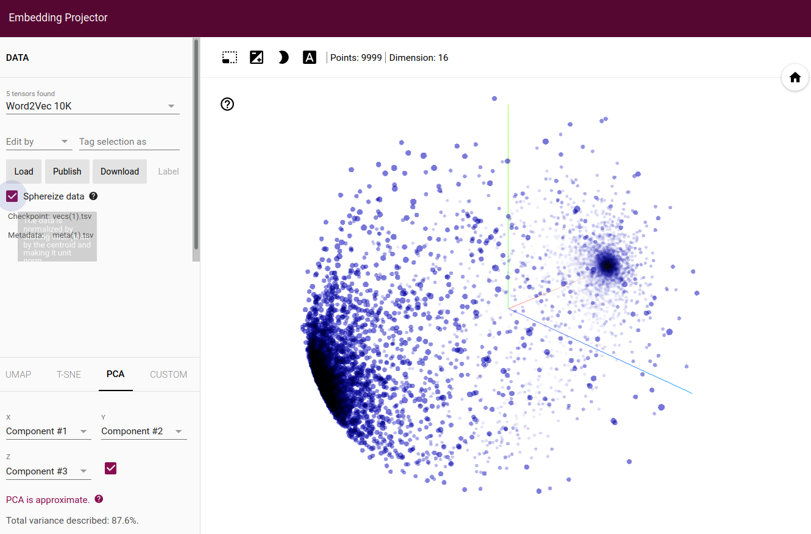

# Natural Language Prosessing

* The "NLP_on_sarcasm_dataset.ipynb" takes dataset from here: https://rishabhmisra.github.io/publications/
* The "NLP_BBC_archive.ipynb" takes the dataset from here: http://mlg.ucd.ie/datasets/bbc.html
* The "NLP_IMDB_dataset.ipynb" uses the IMDB dataset from tensorflow (# !pip install -q tensorflow-datasets)
* Dataset for binary sentiment classification can be found here: http://ai.stanford.edu/~amaas/data/sentiment/

## The Embedding Projector can be found here: https://projector.tensorflow.org/

* For NLP instead of Flatten() usually GlobalAveragePooling1D() is used. 
* Running the NLP_IMDB_dataset.ipynb with GlobalAveragePooling1D() gave a clear clustering between the reviews

